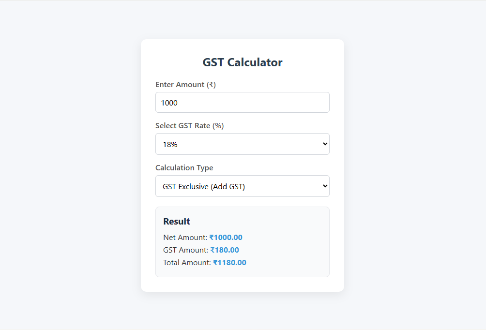

# 🧮 GST Calculator (HTML, CSS & JavaScript)

A simple and responsive **GST Calculator** built using HTML, CSS, and vanilla JavaScript.  
This tool allows users to calculate GST inclusive and exclusive prices based on selected GST rates (5%, 12%, 18%, 28%).

---

## 📷 Screenshot

---

## 🚀 Features

- Select GST rate: 5%, 12%, 18%, 28%
- Choose calculation mode:
  - **GST Exclusive**: Adds GST to base price
  - **GST Inclusive**: Extracts GST from total price
- Real-time calculation
- Responsive and user-friendly UI

---

## 🛠️ Technologies Used

- HTML5
- CSS3
- JavaScript (Vanilla)

---

## 🎥 Watch the Tutorial Video

📺 [Click here to watch the full tutorial on YouTube](https://youtu.be/4kIoYDJwLdY)  

---

## 📁 How to Use

1. Clone or download this repository.
2. Open `index.html` in your browser.
3. Enter amount, select GST %, and see results instantly.

---

## 📌 Author

Made with ❤️ by Deeksha Baghel  
🔗 [YouTube Channel](https://www.youtube.com/channel/UC_d9hL4OIHOUan_SrP-NTqA) • [GitHub](https://github.com/deecodenow1)

---

## 📝 License

Feel free to explore, use, or modify this project for learning or personal use.
